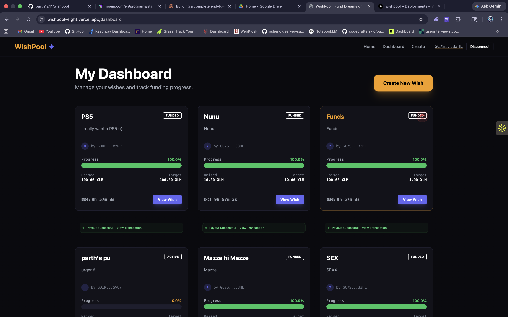
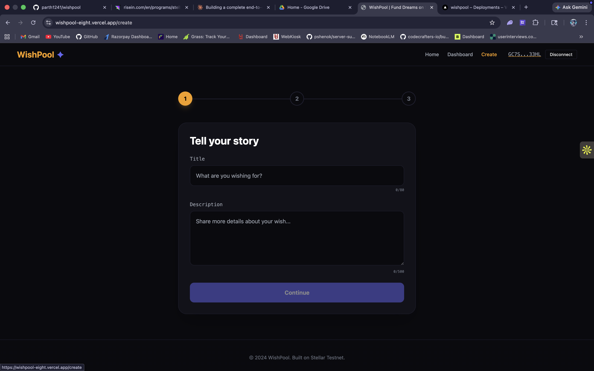
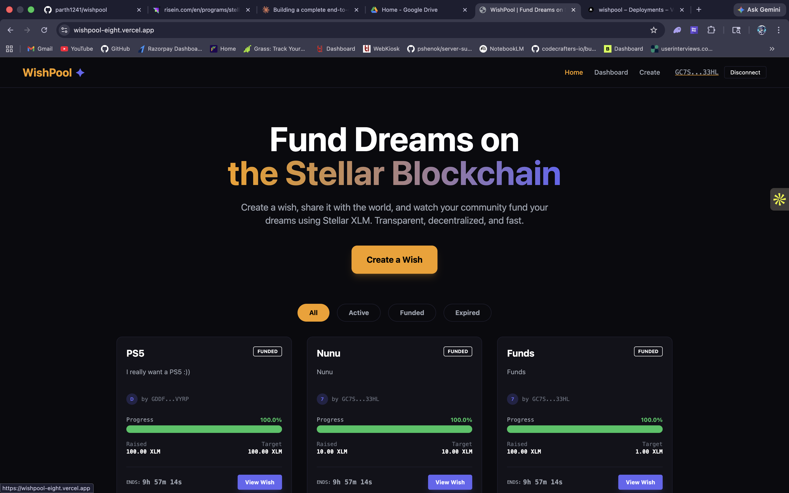
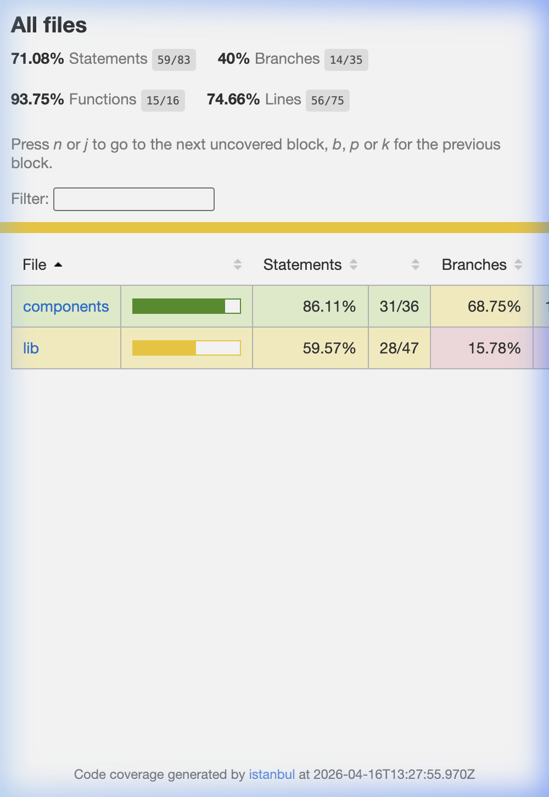

# WishPool ✦ — Fund Dreams on Stellar


WishPool is a decentralized crowdfunding platform built on the **Stellar Testnet**. It allows users to create "Wishes" (crowdfunding campaigns) and receive contributions in XLM. The platform leverages Stellar's speed and low fees to provide a transparent and efficient fundraising experience.

## 🌐 Live Demo
[https://wishpool-stellar.vercel.app](https://wishpool-stellar.vercel.app)

## 🎥 Demo Video
[Watch the 1-minute demo video](./video/demo.mov)

## 📸 Screenshots

### Home Page


### Create a Wish


### User Dashboard


## 📸 Test Output


## ✨ Features
- **Wallet Integration**: Seamless connection with the Freighter wallet.
- **Wish Management Dashboard**: A secure hub for creators to track funding, edit wish details, and manage payouts.
- **Direct On-Chain Contributions**: Real-time XLM transfers from supporter wallets to the WishPool Escrow.
- **Automated Payouts**: Instant funds delivery to creators upon reaching 100% funding, powered by server-side Stellar automation.
- **Bulk Refund System**: Transparent one-click refunds for contributors if a wish expires without meeting its goal.
- **On-Chain Verification**: Robust tracking of `payoutHash` to ensure transparency and prevent double-payments.
- **Live Lifecycle Tracking**: Automatic transitions between `active`, `funded`, `expired`, and `refunded` statuses.
- **Premium UI**: Sleek, high-performance dark mode interface built with TailwindCSS and optimized with in-memory caching.

## 🛠️ Tech Stack
- **Framework**: Next.js 14 (App Router)
- **Language**: TypeScript
- **Blockchain**: Stellar (Testnet)
- **Wallet**: @stellar/freighter-api
- **Database**: MongoDB Atlas with Mongoose
- **Styling**: TailwindCSS
- **State Management**: React Hooks & Session-based persistence
- **Testing**: Jest & React Testing Library

## ⛓️ How Stellar Integration Works
1. **Real-Time Contributions**: When a user funds a wish, the transaction is broadcasted to the Stellar Testnet. Funds are held in a secure Escrow address (`GBRP...`).
2. **Automated Payouts**: When a wish hits its 100% target, the backend automatically builds and signs a transaction from the Escrow to the Creator's specific wallet address.
3. **Manual Finalization**: Creators can retry failed payouts via their Dashboard, ensuring funds are never "stuck" in escrow.
4. **Bulk Refunds**: For failed wishes, the creator can trigger a process that loops through all contributions and sends the XLM back to each contributor's address.
5. **Memo-based Tracking**: Every wish has a unique `stellarMemo`. This is attached to every incoming and outgoing transaction, providing a clear audit trail on-chain.

## 🚀 Local Setup

### Prerequisites
- Node.js 18+
- MongoDB Atlas Account
- Freighter Wallet Extension

### Steps
1. **Clone the repository**
   ```bash
   git clone https://github.com/your-username/wishpool.git
   cd wishpool
   ```

2. **Install dependencies**
   ```bash
   npm install
   ```

3. **Setup environment variables**
   Create a `.env.local` file based on `.env.local.example`.

4. **Run development server**
   ```bash
   npm run dev
   ```
   Open [http://localhost:3000](http://localhost:3000) to see the app.

## 🧪 Running Tests
```bash
# Run unit tests
npm test

# Run tests with coverage
npm run test -- --coverage
```

## 🗂️ Project Structure
```text
wishpool/
├── src/
│   ├── app/                # Next.js App Router (Pages & APIs)
│   ├── components/         # Reusable UI Components
│   ├── lib/                # Shared Utilities & SDK Logic
│   ├── models/             # Mongoose Database Schemas
│   ├── types/              # TypeScript Interfaces
│   └── globals.css         # Global Styles
├── tests/                  # Jest Test Suites
├── screenshots/            # Project Screenshots
├── video/                  # Demo Video
├── tailwind.config.ts      # Tailwind Configuration
├── tsconfig.json           # TypeScript Configuration
└── jest.config.js          # Jest Configuration
```

## 📄 License
MIT
